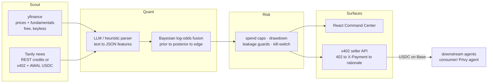

# AlphaNet-402

**An equities intelligence agent that pays for its own data — x402 micropayments on Base, Bayesian signal fusion in Python.**

AlphaNet-402 sits at the intersection of two ideas:

- **Agent-to-agent commerce (blockchain):** the agent *buys* market intelligence
  over [x402](https://www.x402.org/) (HTTP 402 + USDC on Base) when it needs paid
  news, and *sells* the causal chain behind every signal to other agents through
  its own 402-paywalled API — $0.01 per rationale, idempotent receipts, no
  subscriptions, no API keys between machines.
- **Quant finance:** every belief is a probability. Real price history and
  fundamentals become evidence features; a fixed log-odds table fuses them into
  a Bayesian posterior; `edge = posterior − prior` drives paper BUY/SELL/HOLD
  decisions behind spend caps, drawdown limits, and leakage guards.

The LLM (Groq, optional) is used **only** as an NLP parser — prose in, strict
JSON features out. All probabilities, edges, and position sizes are computed in
deterministic Python.

---

## Architecture



## Run it (3 commands, no keys needed)

```bash
./run_backend.sh     # FastAPI agent → http://localhost:8000
./run_frontend.sh    # Command Center → http://localhost:5173
curl -X POST http://localhost:8000/api/cycle   # one scout→quant→risk pass
```

Keyless mode is fully real: yfinance prices/fundamentals, heuristic NLP,
Bayesian math, paper decisions. Add keys to upgrade individual stages (see
`alphanet-core/backend/.env.example`).

## Paid data: Tavily over x402

Tavily is the agent's paid news source, and the reason this project exists on
a payments rail at all. What actually happens:

- **What is bought:** one finance-topic search per watchlist ticker per cycle —
  institutional ownership changes, insider transactions, analyst actions.
  Results are merged with the free yfinance events before NLP.
- **When:** only when configured. With `TAVILY_API_KEY` set, the agent uses
  Tavily REST (plan credits, $0 USDC). With no key and `TRADING_MODE=LIVE`, it
  pays Tavily's x402 endpoint (`402.tavily.com`) directly in USDC via
  `npx awal x402 pay` — a real machine-to-machine purchase, no account needed.
- **Cost controls:** hard per-search cap (`MAX_PRICE_PER_SEARCH_USDC`, default
  $0.01), hard daily cap (`MAX_DAILY_SPEND_USDC`, default $2.00), every spend
  written to an auditable ledger, and a kill-switch that halts the loop the
  moment a cap is breached.

## Selling its own alpha

Any agent can buy the full causal chain behind a signal:

```
GET /api/alpha/AAPL/rationale        → 402 + invoice (payTo, USDC, Base CAIP-2)
GET ... + X-Payment: <receipt>       → 200 + prior → evidence → posterior → decision
```

The paid payload carries the full causal chain **plus source provenance**
(the exact yfinance/Tavily links behind that signal). Revenue is booked only
when the settlement is **verified on-chain** (see below); the agent is also
discoverable via a Bazaar-style record at `GET /api/x402/discovery`.

A Privy-authorized consumer agent that performs this loop end-to-end lives in
[`consumer/`](consumer/) (`@privy-io/node` + `@x402/fetch`; the human approves
once, the key stays in a TEE).

### Settlement verification (revenue is booked on proof, not a header)

Before crediting a sale, the seller extracts the settlement tx hash from the
`X-Payment` proof and confirms it on Base Sepolia via
`eth_getTransactionReceipt` (raw JSON-RPC, `SETTLEMENT_RPC_URL`): the tx must
have succeeded **and** carried a USDC `Transfer` to our payTo for the invoiced
amount. Only then does `daily_revenue_usdc` move. Payments that can't be
verified are still served but recorded as `unverified` and **excluded from
revenue**; demo headers book nothing. The Command Center labels verified vs
unverified separately, and the **Unit economics** page shows the resulting
spend-vs-revenue P&L.

## Honest status

- **Testnet + paper trading.** Base Sepolia by default; decisions are paper
  positions with notional sizing. No real brokerage, no real PnL claims.
- **Real by default:** yfinance data, Tavily news (verified live), Groq parse
  (verified live), Bayesian math, spend ledger, risk halts, 402 invoices.
- **Demo mode is opt-in and labeled:** `DEMO_MODE=1` swaps in synthetic
  headlines that carry `"demo": true` end-to-end plus a visible UI badge.
  Demo `X-Payment` headers never book revenue.
- **Incoming x402 receipts are now verified on-chain** before booking revenue
  (`eth_getTransactionReceipt` on Base Sepolia); unverifiable payments are
  served but excluded from revenue. Live order routing is still not implemented.
  See [`docs/PROJECT-NOTES.md`](docs/PROJECT-NOTES.md).
- **LIVE-mode caveat (honest):** the LIVE x402 *purchase* path and CLI wallet
  resolution shell out to `npx awal` (Node). The documented Render deploy
  (`render.yaml`, `runtime: python`) does **not** provision Node, so the LIVE
  buy path is unreachable there by design — set `OUR_AWAL_WALLET_ADDRESS` and
  use `TAVILY_API_KEY` (REST) or run locally with Node for x402 buys.
- The 402 seller **refuses to run without a configured wallet** — there is no
  zero-address fallback.

## Tests & CI

- `cd alphanet-core/backend && pytest tests -q` — **81 offline tests**: Bayesian
  update math + the configurable blend, leakage guards, heuristic parser,
  mocked Tavily ingestion, budget caps, demo labeling, payment fail-hard
  behavior, admin-token auth, and on-chain settlement verification (verified /
  unverified / demo revenue paths, tx-hash extraction, USDC transfer matching).
- GitHub Actions: ruff + pytest + frontend build on every push
  ([`.github/workflows/ci.yml`](.github/workflows/ci.yml)).

## Layout

| Path | What |
| --- | --- |
| `alphanet-core/backend` | FastAPI agent: scout, quant, risk, x402 seller |
| `alphanet-core/frontend` | React Command Center (Vite + Tailwind) |
| `consumer/` | x402 consumer agent (Privy + `@x402/fetch`) |
| `docs/` | architecture, wallet setup, project notes |
| `render.yaml` | backend deploy (Render free tier) |

## Stack

FastAPI · SQLAlchemy/SQLite · yfinance · Tavily · Groq (optional) · React ·
Vite · Tailwind · x402 · AWAL · Privy · USDC on Base.
