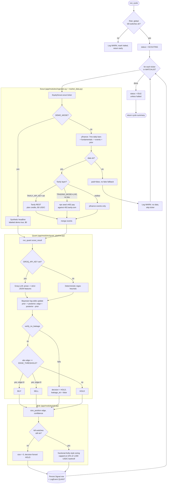

# AlphaNet-402 — architecture

AlphaNet-402 is a single FastAPI process that runs an autonomous scout →
quant → risk loop over an equity watchlist, persists everything to SQLite,
and exposes two HTTP surfaces: a dashboard API for the React Command Center
and a machine-to-machine x402 paywall that resells the causal chain behind
each signal for $0.01 USDC. A separate TypeScript `consumer/` agent
demonstrates the buy side of that same x402 handshake.

This document supersedes the previous short-form architecture note. See
`docs/PROJECT-NOTES.md` for operator-facing behavior notes and the honest
limitations list, and `docs/CODE-AUDIT.md` for a ranked audit of weak spots.

---

## 1. Folder map

```
alphanet-402/
├── alphanet-core/
│   ├── backend/                  FastAPI app (the agent)
│   │   ├── app/
│   │   │   ├── main.py           App factory, lifespan, CORS, /health
│   │   │   ├── agent_loop.py     Background asyncio loop + run_cycle()
│   │   │   ├── database.py       SQLAlchemy engine/session, init_db()
│   │   │   ├── models.py         AgentState, LogEvent, Signal, X402Receipt
│   │   │   ├── core/config.py    Pydantic Settings (env-driven)
│   │   │   ├── api/
│   │   │   │   ├── routes.py     Aggregator: includes the three routers below
│   │   │   │   ├── dashboard.py  Dashboard API + economics + judge demo
│   │   │   │   ├── admin.py      Admin control (/api/cycle, /api/reset)
│   │   │   │   └── x402.py       x402 seller + settlement booking + discovery
│   │   │   └── modules/
│   │   │       ├── market_data.py   yfinance fetch + pure feature math
│   │   │       ├── ingestion.py     Scout orchestration (yfinance/Tavily/demo) + budget
│   │   │       ├── quant_pipeline.py NLP parse + Bayesian log-odds fusion + leakage guard
│   │   │       ├── settlement.py    On-chain x402 settlement verification (JSON-RPC)
│   │   │       └── risk.py          Kill-switches + position sizing
│   │   ├── tests/                 81 offline pytest tests (see §5)
│   │   ├── conftest.py            Isolated sqlite temp DB, neutral settings fixture
│   │   ├── requirements.txt
│   │   └── .env.example
│   └── frontend/                  React (Vite + Tailwind) Command Center
│       └── src/
│           ├── api.js              fetch wrapper, all backend calls
│           ├── App.jsx             Route table
│           ├── components/         AppShell (nav), Panel/Stat/Pill, SignalDrawer
│           ├── pages/               Dashboard, SignalDetail, X402Lab, JudgeDemo,
│           │                        Pitch, PitchDeck, Architecture, WalletSetup
│           └── utils/               trading.js (formatters), pitchDemoVideo.js
├── consumer/
│   └── consumer-agent.ts          Privy-wallet x402 buyer: 402 → sign → retry → 200
├── docs/
│   ├── ARCHITECTURE.md            This file
│   ├── CODE-AUDIT.md              Honest weak-spot audit
│   ├── PROJECT-NOTES.md           Operator notes, data-path table, known limitations
│   └── AWAL_WALLET_SETUP.md       AWAL CLI auth/funding checklist
├── render.yaml                    Backend deploy (Render free tier, Python runtime)
├── run_backend.sh / run_frontend.sh
└── package.json                   Root scripts delegate to alphanet-core/frontend
```

Note: the dead doc links that used to point at non-existent files
(`DEMO_GUIDE.md`, `PITCH_DECK_PRESENT.md`, `cdp-llms.txt`) were removed from
the UI in campaign 3.

---

## 2. The agent cycle (scout → quant → risk → store)

`agent_loop.run_cycle()` is the one function that does the real work. It is
synchronous Python, called either from the background `asyncio` loop
(`_loop()`, every `LOOP_INTERVAL_SECONDS`) or synchronously from
`POST /api/cycle` (admin-token gated).



Key invariants enforced in code:

- **No silent fake data.** A failed yfinance fetch returns `paid=False` and
  the ticker is skipped with a `WARN` log — it never falls back to demo data
  unless `DEMO_MODE=1` is explicitly set (`ingestion.py::_market_data_scout`).
- **The LLM is NLP-only.** `quant_pipeline.parse_sentiment()` returns strict
  JSON features; `calculate_chf_leakage_safe_edge()` (pure Python, fixed
  log-odds table) computes the actual posterior/edge. The LLM path and the
  heuristic path are interchangeable inputs to the same math.
- **Leakage guard runs after the fact but before the decision is used.**
  `verify_no_leakage()` checks (a) prior wasn't captured after decision time,
  (b) evidence isn't empty, (c) no future-year reference in raw text. Failure
  forces `HOLD` and flips `leakage_ok=False` on the stored signal — the
  computed posterior/edge are still stored, just not acted on.
- **Idempotency.** Each `(cycle_id, ticker)` pair becomes `idempotency_key` on
  the `Signal` row (unique + indexed), so a retried cycle can't double-write.

---

## 3. x402 request flow (two directions)

AlphaNet-402 sits on both sides of x402: it is a **buyer** of Tavily news
(only when `TRADING_MODE=LIVE` and no REST key is configured) and a
**seller** of its own rationale to any downstream agent.

```mermaid
sequenceDiagram
    participant Buyer as Downstream agent<br/>(consumer/consumer-agent.ts)
    participant API as AlphaNet-402 API<br/>(api/x402.py)
    participant RPC as Base Sepolia RPC<br/>(eth_getTransactionReceipt)
    participant DB as SQLite<br/>(X402Receipt, LogEvent)

    Buyer->>API: GET /api/alpha/AAPL/rationale (no X-Payment)
    API->>API: resolve_pay_to() — configured wallet or npx awal address --json
    alt no wallet configured
        API-->>Buyer: 503 "x402 selling disabled"
    else wallet configured
        API-->>Buyer: 402 + invoice {scheme, network CAIP-2, maxAmountRequired=1000 (atomic), payTo}
    end

    Note over Buyer: Privy TEE signs a $0.01 USDC authorization;<br/>x402 facilitator settles on Base Sepolia, returns tx hash

    Buyer->>API: GET /api/alpha/AAPL/rationale<br/>X-Payment: <proof carrying settlement tx hash>
    API->>DB: receipt_key = sha256(X-Payment + signal_id) — exists?
    alt exact (proof, signal) replay
        DB-->>API: existing payload_json
        API-->>Buyer: 200 + cached causal_chain JSON (books nothing again)
    else new receipt_key
        alt demo- proof (UI "simulate paid" buttons)
            API->>DB: LogEvent INFO — served, no revenue
        else non-demo proof
            API->>API: extract tx hash from proof
            API->>RPC: eth_getTransactionReceipt(tx)
            RPC-->>API: status + logs
            API->>API: status==success AND USDC Transfer to payTo >= amount?
            alt not verifiable (no tx / RPC down / no matching transfer)
                API->>DB: daily_unverified_usdc += 0.01, LogEvent WARN — excluded from revenue
            else verified
                API->>DB: any receipt with this tx_hash already booked revenue?
                alt tx already consumed (replay across a different signal)
                    API->>DB: LogEvent WARN — payment_status=duplicate, no revenue
                else first use of this tx
                    API->>DB: daily_revenue_usdc += 0.01, LogEvent REVENUE +0.01
                end
            end
        end
        API->>DB: insert X402Receipt(receipt_key, tx_hash, amount, payload_json)
        API-->>Buyer: 200 + causal_chain + sources + payment_status + quality
    end
```

**Settlement verification (campaign 3).** Before booking revenue for a
non-`demo-` payment, the seller extracts a settlement tx hash from the
`X-Payment` proof and confirms it on Base Sepolia via
`eth_getTransactionReceipt` (`app/modules/settlement.py`, raw JSON-RPC over
httpx): the tx must have succeeded and carried a USDC `Transfer` to our payTo
for the invoiced amount. Verified → `daily_revenue_usdc += 0.01`; unverifiable
→ served but recorded in `daily_unverified_usdc`, **excluded from revenue**;
demo → nothing booked. **A settlement tx books revenue at most once globally:**
`X402Receipt.tx_hash` is indexed and checked before crediting, so the same
settled transfer replayed against a different signal is recorded as
`duplicate` (served, no revenue) rather than paying out again — the per-(proof,
signal) `receipt_key` alone only stops exact replays. The payload carries
`payment_status` (demo|verified|unverified|duplicate), `settlement_tx`, and
`sources` provenance. In practice:

- The Command Center's own "Simulate paid" buttons (`api.js`) hardcode a
  `demo-settlement-proof-*` prefix, so clicking around the UI never inflates
  `daily_revenue_usdc`.
- The TypeScript `consumer/` agent and any real caller supply an `X-Payment`
  proof; the backend verifies it on-chain before crediting revenue and never
  books an unverifiable payment.
- The Command Center labels verified revenue vs unverified attempts separately
  (Dashboard "x402 revenue (verified)" panel), and the **Unit economics** page
  renders the spend-vs-verified-revenue P&L from the ledger.

The outbound (buyer) direction — `ingestion.py::_live_pay` — shells out to
`npx awal x402 pay <url> --max-amount <atomic> --json` and parses stdout for
a `txHash`/`results` body; failures (`TimeoutExpired`, `FileNotFoundError`,
`OSError`, non-zero exit) all degrade to `paid=False` rather than raising,
and are logged under category `X402`.

---

## 4. Config surface (`app/core/config.py`)

All configuration is env-driven via `pydantic_settings.BaseSettings`
(`.env` file + process env, `extra="ignore"`). One process-wide singleton
`settings = get_settings()` (lru-cached) is imported everywhere.

| Variable | Default | Effect |
| --- | --- | --- |
| `TRADING_MODE` | `PAPER` | `LIVE` additionally allows x402 USDC spend for Tavily news |
| `DEMO_MODE` | `False` | Replaces scout data with labeled synthetic headlines |
| `LOOP_INTERVAL_SECONDS` | `30` | Background cycle cadence |
| `NETWORK_CAIP_ID` | `eip155:84532` (Base Sepolia) | Network id in invoices and `/health` |
| `USDC_CONTRACT_ADDRESS` | Sepolia test USDC | Informational; not enforced in code path |
| `AWAL_X402_PAY_EXTRA` | `--chain base-sepolia` | Extra CLI flags appended to `awal x402 pay` |
| `MAX_DAILY_SPEND_USDC` | `2.00` | Hard daily scout budget (kill-switch) |
| `MAX_PRICE_PER_SEARCH_USDC` | `0.01` | Hard per-query price cap |
| `EDGE_THRESHOLD` | `0.05` | Minimum `\|edge\|` to act (else HOLD) |
| `BAYES_TABLE_WEIGHT` | `0.65` | Convex blend weight on the evidence-table posterior; sentiment channel gets the remainder |
| `SETTLEMENT_RPC_URL` | `https://sepolia.base.org` | Base RPC for sell-side settlement verification; empty ⇒ verification off (non-demo sales record `unverified`) |
| `SCOUT_HTTP_TIMEOUT_SECONDS` / `AWAL_PAY_TIMEOUT_SECONDS` / `AWAL_ADDRESS_TIMEOUT_SECONDS` | `15` / `45` / `20` | Bounded timeouts for yfinance+Tavily HTTP, the awal pay subprocess, and awal address resolution |
| `DAILY_DRAWDOWN_LIMIT_USDC` | `5.00` | Halts the loop when breached |
| `TAVILY_402_ENDPOINT` / `TAVILY_REST_ENDPOINT` | tavily.com URLs | Paid news gateways |
| `TAVILY_API_KEY` | empty | Present + not a placeholder → REST path wins over x402 |
| `OUR_AWAL_WALLET_ADDRESS` | empty | payTo for our own invoices; **no zero-address fallback** — selling is refused (503) until set |
| `GROQ_API_KEY` / `GROQ_MODEL` | empty / `llama-3.3-70b-versatile` | NLP extraction only; empty → heuristic parser |
| `SENTRY_DSN` / `SENTRY_ENVIRONMENT` | empty | Optional error tracking, initialized once at import time in `main.py` |
| `WATCHLIST` | `AAPL,MSFT,NVDA` | Comma-separated tickers scouted each cycle |
| `ALPHANET_ALLOWED_ORIGINS` | localhost dev origins | Explicit CORS allowlist; wildcard entries are stripped, never honored |
| `ADMIN_TOKEN` | empty | Bearer token for `/api/reset` and `/api/cycle`; empty ⇒ both endpoints return 503 (disabled), never open |

Derived properties worth knowing: `settings.data_mode` (`demo` /
`yfinance+tavily_rest` / `yfinance+tavily_x402` / `yfinance`, surfaced in
`/health` and the UI header), `settings.watchlist` (parsed list),
`settings.allowed_origins` (parsed + wildcard-stripped list),
`settings.is_live`, `settings.tavily_key_ok`.

---

## 5. Test layout

```
alphanet-core/backend/
├── conftest.py                    Root fixtures — MUST run first:
│                                   sets ALPHANET_DB_PATH to a temp file
│                                   before any app module import (avoids
│                                   touching the real alphanet.db), then
│                                   an autouse fixture neutralizes
│                                   TRADING_MODE/DEMO_MODE/keys/caps for
│                                   every test, plus a `db` fixture that
│                                   drops+recreates all tables per test.
└── tests/
    ├── test_market_data.py        Pure functions: compute_features,
    │                              estimate_prior, build_events — no I/O.
    ├── test_ingestion.py          EquityScout with httpx mocked
    │                              (_FakeClient); budget cap enforcement;
    │                              _merge_results; scout failure paths.
    ├── test_quant_math.py         bayesian_update, the log-odds evidence
    │                              table, leakage guard, heuristic NLP
    │                              parser, run_quant integration + the
    │                              config-driven blend math.
    ├── test_settlement.py         On-chain settlement verification: tx-hash
    │                              extraction (raw/JSON/base64), USDC transfer
    │                              matching, RPC verdicts (mocked httpx), and
    │                              the full verified/unverified/demo revenue
    │                              paths + idempotency + provenance.
    └── test_demo_and_config.py    Demo-mode labeling end-to-end; payment
                                   fail-hard (resolve_pay_to, 503/402);
                                   demo X-Payment books no revenue; unit
                                   economics endpoint; x402 discovery doc;
                                   CORS allowlist; admin-token auth on
                                   /api/reset and /api/cycle.
```

81 tests total, all offline (network calls mocked or routed through
deterministic code paths), run in well under a second: `pytest tests -q`.
`ruff check .` is clean. Both are also enforced in CI
(`.github/workflows/ci.yml`) on push to `main`/`diverge-equities` and on PRs,
alongside a frontend `npm run build` job. There is no frontend test suite —
see CODE-AUDIT.md.

---

## 6. Surfaces at a glance

- **FastAPI** (`app/main.py`, `app/api/routes.py`): `/health`, dashboard API
  (`/api/state`, `/api/signals`, `/api/signals/{id}`, `/api/logs`), admin
  control (`POST /api/reset`, `POST /api/cycle` — bearer-token gated),
  x402 seller (`/api/alpha/{ticker}/rationale`,
  `/api/trade/{signal_id}/rationale`), and a judge-demo pair
  (`/api/demo/briefing`, `POST /api/demo/judge-run`).
- **React Command Center** (`alphanet-core/frontend`): Overview dashboard,
  per-signal detail page + slide-over drawer, x402 Lab (manual invoice/paid
  request playground), a judge walkthrough page, a static pitch deck, and
  static architecture/wallet-setup reference pages. Polls `/api/state`,
  `/api/signals`, `/api/logs` every 4s.
- **SQLite** (`app/database.py`, `app/models.py`): single file, path from
  `ALPHANET_DB_PATH` (defaults next to the backend package; `/tmp` on Render
  free tier — explicitly ephemeral by design). Four tables: `agent_state`
  (singleton row), `log_events` (append-only, doubles as the spend/revenue
  ledger), `signals`, `x402_receipts`.
- **consumer/** (TypeScript): a standalone Privy-wallet x402 buyer agent
  demonstrating the client side of §3 against a running backend.
